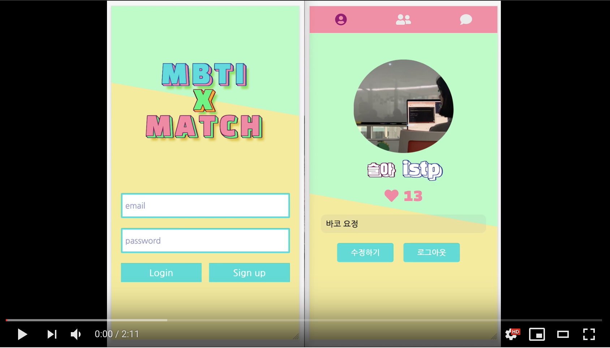

# mbti-match

[](https://youtu.be/ApJpejiBE9I)

소개팅 모바일 웹 어플리케이션입니다. 
매칭이 되었을 시 사용자와 상대방의 [mbti]([https://en.wikipedia.org/wiki/Myers%E2%80%93Briggs_Type_Indicator](https://en.wikipedia.org/wiki/Myers–Briggs_Type_Indicator)) 적합성을 결과로 알려주고 socket.io를 이용하여 채팅 하실 수 있습니다.

## Installation

#### Client

```
git clone https://github.com/yami03/mbti-match-client.git
cd mbti-match-client
npm install
npm run dev
```

#### Server

```
git clone https://github.com/yami03/mbti-match-server.git
cd mbti-match-server
npm install
npm run dev
```

로컬에서 실행시 /.env 파일이 필요합니다.

```
NODE_ENV=development
DATABASE_URI
AWS_ACCESSKEYID
AWS_SECRETACCESSKEY
```

* DATABASE_URI: Mongodb와 연결할 connection string 
*  AWS_ACCESSKEYID: 액세스할 수 있는 권한이 있는지 여부를 확인하는 Amazon Web Services(AWS)의 엑세스 키 ID
* AWS_SECRETACCESSKEY: 액세스할 수 있는 권한이 있는지 여부를 확인하는 Amazon Web Services(AWS)의 시크릿 키

## Features

* Passport.js를 이용한 local login
* Session을 이용하여 login 유지
* 회원가입시 s3를 이용하여 프로필 사진 업로드
* 상대방의 프로필을 보고 좋아요 혹은 싫어요로 체크
* 좋아요를 클릭했을 경우 매칭되어 mbit 적합성을 백분율로 확인 가능
* 좋아요나 싫어요를 클릭한 회원은 더이상 회원목록에서 보이지 않음
* 매칭되었을 시 채팅 가능

## Skills

#### Client-Side

* ES2015+
* React
* Redux
* Socket.io-Client
* Sass
* Axios API

#### Server-Side

* Node.js
* Express
* ES2015+
* MongoDB
* Mongoose
* Passport.js
* socket.io
* AWS S3

## Deployment

* **Server**

  AWS Elastic Beanstalk 

* **Client**

  Netlify

## Project Control

* Trello를 이용한 Task 관리
* Lucid chart를 이용한 Schema Design
* Balsamiq Mockup을 이용한 UI 설계
* Postman을 이용한 API 테스트

## Challenges

* Schema Design에서 고민이 많았습니다. 
  사용자가 회원목록에서 좋아요나 싫어요의 선택에 따라 회원목록 리스트와 채팅 리스트가 변경 되기 때문에 Design이 중요하였고, 중복되는 데이터를 최소한으로 줄이도록 하는게 목표였습니다.  Lucid Chart를 이용하여 Schema Design을 했던게 매우 도움이 되었습니다.
  중복 데이터에 관련하여서는 매칭된 회원을 연결하는 채팅룸의 id는 따로 만들지 않고 Mongodb에서 제공해주는 _id를 사용하였습니다. 
  또한 사용자가 회원목록에서 싫어요나 좋아요를 클릭한 경우 회원목록에서 더이상 보이지 않는데 이 경우 싫어요를 클릭한 경우 회원정보를 저장하였지만 좋아요를 클릭한 경우 저장하지 않고 Chat Data에서 회원정보를 이용하여 회원목록을 필터하였습니다. 여러 데이터를 가지고 회원목록을 필터하다보니 Mongoose 쿼리빌더에 대해 더욱 공부하게 되었습니다.

## Tings To Do

* 회원가입시 Mail 인증
* 나를 좋아요 클릭한 회원목록 확인하기
  * mbti best match
  * mbti worst match

#### Sincere Thanks

[Vanilla Coding](https://github.com/vanilla-coding)

